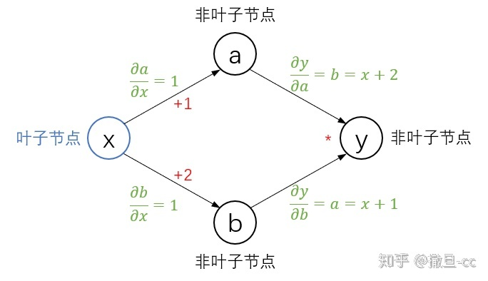
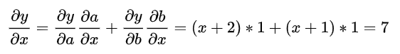

## Pytorch Tensor & Variable

### Reference
- [Pytorch求导相关](https://zhuanlan.zhihu.com/p/279758736)

### Graph
Pytorch中的计算图里只有两种元素, 数据(`tensor`)和运算(`operation`)

运算包括: 加减乘除, 开方, 幂指对, 三角函数等可求导运算

数据可分为: __叶子节点__(`leaf node`) 和 __非叶子节点__
- 叶子节点: 用户创建的节点, 不依赖于其他节点
- 反向传播结束后, 非叶子节点的梯度会被释放, 只保留叶子节点的梯度, 节省了内存
- 如果想要保存非叶子节点的梯度, 可以使用`retain_grad()`方法, 会增大内存占用

`torch.tensor`的属性:
- `tensor.requires_grad`: 查看是否可以求导, 自定义的叶子节点默认为`False`, 非叶子节点默认为`True`, 神经网络中的权重默认为`True`
- `tensor.grad_fn`: 查看运算名称
- `tensor.is_leaf`: 查看是否为叶子节点
- `tensor.grad`: 查看导数值

Addition:
- 判断哪些节点是`True/False`的原则之一: `需要求导的叶子节点`到`loss节点`之间是一条可求导的通路

### Example
计算图如下:


y = (x+1)*(x+2) 当 x=2 时的导数, 其中只有用户创建的x是叶子节点, a, b, y是中间节点
```
x = torch.tensor([2.], requires_grad=True)

a = torch.add(x, 1)
b = torch.add(x, 2)
y = torch.mul(a, b)

y.backward()
print(x.grad)

>>> tensor([7.])
```
查看tensor的属性
```
print("requires_grad: ", x.requires_grad, a.requires_grad, b.requires_grad, y.requires_grad)
print("is_leaf: ", x.is_leaf, a.is_leaf, b.is_leaf, y.is_leaf)
print("grad: ", x.grad, a.grad, b.grad, y.grad)

>>> requires_grad:  True True True True
>>> is_leaf:  True False False False
>>> grad:  tensor([7.]) None None None
```
- 可以发现对于叶子节点保存其梯度值, 非叶子节点没有保存梯度值
- 用户创建的`x`是叶子节点, 其余均不是叶子节点

### 梯度清零
Pytorch的自动求导梯度不会自动清零, 会累积, 所以在反向传播后需要手动清零
```
tensor.grad.zero_()
```

### Detach()
Detach可以切断计算图, 不再往后计算梯度, 如果`模型B`需要用到`模型A`的`输出`作为`输入`, 但是这一步训练只需要训练模型B

Example A:
```
input_B = output_A.detach()
```
Example B:
```
model_A = ...
model_B = ...
output_A = model_A(data)
output_B = model_B(output_A.detach())
```
将`a`切断, 只有`b`一条通路, 且`a`变为叶子节点
```
x = torch.tensor([2.], requires_grad=True)

a = torch.add(x, 1).detach()
b = torch.add(x, 2)
y = torch.mul(a, b)

y.backward()

print("requires_grad: ", x.requires_grad, a.requires_grad, b.requires_grad, y.requires_grad)
print("is_leaf: ", x.is_leaf, a.is_leaf, b.is_leaf, y.is_leaf)
print("grad: ", x.grad, a.grad, b.grad, y.grad)

>>> requires_grad:  True False True True
>>> is_leaf:  True True False False
>>> grad:  tensor([3.]) None None None
```
`x.grad=3`是因为在求导的时候, 不需要求`a`分支